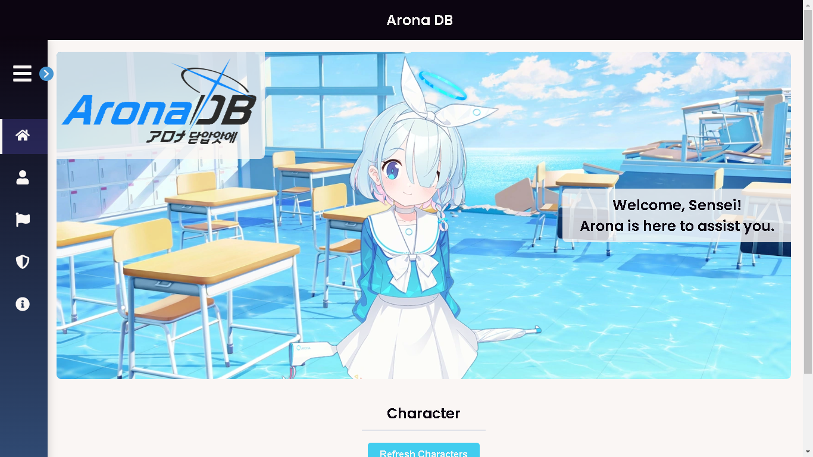
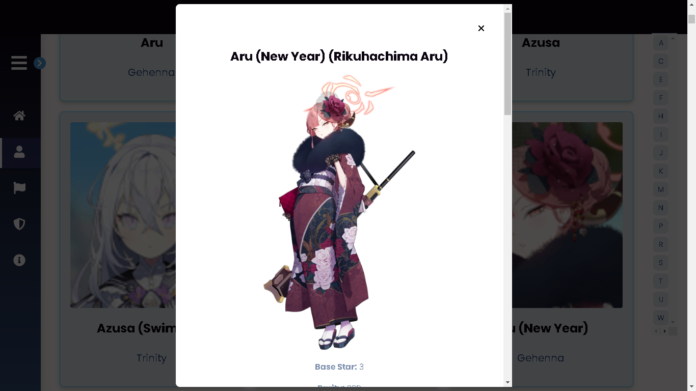

# Arona DB

**Arona DB** is a React-based web application designed to provide comprehensive information about characters, banners, and raids from the game **Blue Archive**. This project aims to deliver an interactive and responsive experience for Blue Archive fans.

## 🎯 Key Features
- **Character Page**: Displays detailed information about characters from various schools and clubs.
- **Banner Page**: Information about ongoing, upcoming, and past gacha banners.
- **Raid Page**: Details of active and scheduled raids.
- **Offline Mode**: Supports offline search functionality through a service worker.
- **Responsive UI**: Optimized for various devices to ensure a seamless experience.

## 🛠️ Technologies Used
- **React JS**: The primary framework for building the application.
- **Axios**: For fetching data from external APIs.
- **Service Worker**: To enable offline functionality.
- **CSS Modules**: Component-specific styling.

## 📂 Project Structure
```
arona-db/
├── public/               # Static files
├── src/                  # Main source code
│   ├── assets/           # Images and visual resources
│   ├── components/       # UI components (Header, Modal, Navbar)
│   ├── pages/            # Main application pages
│   ├── App.js            # Root component of the application
│   ├── index.js          # Application entry point
│   ├── service-worker.js # Service worker for caching
│   └── ...               # Other files
├── package.json          # npm configuration and dependencies
├── README.md             # Project documentation
└── ...
```

## 🚀 Getting Started
1. Clone the repository:
   ```bash
   git clone https://github.com/username/arona-db.git
   ```
2. Navigate to the project directory:
   ```bash
   cd arona-db
   ```
3. Install dependencies:
   ```bash
   npm install
   ```
4. Run the application:
   ```bash
   npm start
   ```
5. Access the app at [http://localhost:8000](http://localhost:8000).

## 🌐 APIs Used
- **Blue Archive APIs**: Providing character, banner, and raid data.
  - [https://api.ennead.cc/buruaka/](https://api.ennead.cc/buruaka/)
  - [https://api-blue-archive.vercel.app](https://api-blue-archive.vercel.app)

## 🖼️ Screenshots
| Page      | Preview                     |
|-----------|-----------------------------|
| Home      |  |
| Character |  |

## 🤝 Contributing
Contributions are welcome! Feel free to fork this repository and submit a pull request.

1. Fork this repository.
2. Create a new feature branch:
   ```bash
   git checkout -b new-feature
   ```
3. Commit your changes:
   ```bash
   git commit -m "Add new feature"
   ```
4. Push to the branch:
   ```bash
   git push origin new-feature
   ```
5. Open a pull request.

## 📜 License
This project is licensed under the [MIT License](LICENSE).

---

> **Developed with 💙 by [Vyo Haryadi](https://github.com/vyoharyadi)**  
> For inquiries, feel free to contact me at [vyoharyadi@gmail.com](mailto:vyoharyadi@gmail.com).
